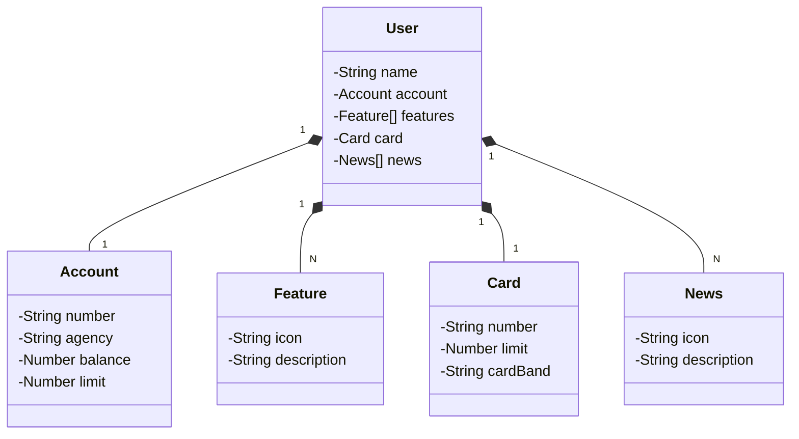

# Bank International

## Descrição do Projeto

Este projeto é uma API RESTful que simula um banco, demonstrando a estrutura de clientes, contas, cartões e outras funcionalidades.

### Tecnologias Utilizadas
- **Java 17**
- **Spring Boot**
- **Gradle** para gerenciamento de dependências
- **H2** para testes e desenvolvimento
- **PostgreSQL** para a implantação
- **Thymeleaf** para Front-end


### Funcionalidades
- Gestão de clientes
- Gestão de contas
- Gestão de cartões
- Exibição de notícias e recursos disponíveis

### Endpoints API


### Exemplo json para criação de uma conta

```
{
    "name": "Maria Oliveira",
    "account": {
      "number": "654321",
      "agency": "002",
      "balance": 2500.50,
      "limit": 5000
    },
    "card": {
      "number": "9876 5432 1098 7654",
      "limit": 6000,
      "cardBrand": "MasterCard"
    },
    "features": [
      {
        "icon": "💳",
        "description": "Cartão de crédito"
      },
      {
        "icon": "🤑",
        "description": "Descontos em lojas parceiras"
      }
    ],
    "news": [
      {
        "icon": "📰",
        "description": "Mudanças nas políticas de saque."
      },
      {
        "icon": "📈",
        "description": "Novas oportunidades de investimento."
      }
    ]
}

```

### Demonstração do Diagrama de Classes do Sistema




### Implantação
A aplicação foi implantada na plataforma Railway e pode ser acessada através do seguinte link:

[Link do Deploy  com a documentação Swagger](https://api-rest-bk.up.railway.app/swagger-ui/index.html) 

[Link do Deploy  com front end](https://api-rest-bk.up.railway.app/hello)

**Obs:** Apenes 10 contas ficaram no banco, ao ultrapassar isso o banco sera zerado automaticamente.
### Como Executar o Projeto em loco
1. Clone o repositório:
   ```bash
   git clone <URL do repositório>
   cd <nome do repositório>
   ```

2. Compile e execute a aplicação:
   ```bash
   ./gradlew bootRun
   ```

3. Acesse a documentação da API no Swagger UI.

### Contribuição
Sinta-se à vontade para contribuir com o projeto! Envie suas sugestões ou correções por meio de pull requests.


