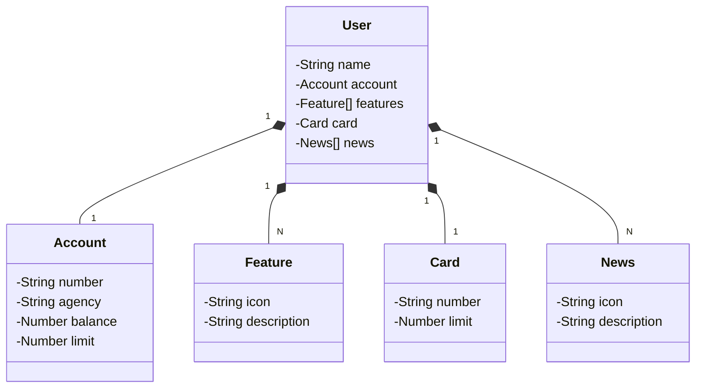

# API RESTfull - Bank International

## Demonstração do Diagrama de Classes do Sistema



## Descrição do Projeto

Este projeto é uma API RESTful que simula um banco, demonstrando a estrutura de clientes, contas, cartões e outras funcionalidades.

### Tecnologias Utilizadas
- **Java 17**
- **Spring Boot**
- **Gradle** para gerenciamento de dependências
- **H2** para testes e desenvolvimento
- **PostgreSQL** para a implantação

### Implantação
A aplicação foi implantada na plataforma Railway e pode ser acessada através do seguinte link:

[Link do Deploy](https://api-rest-bk.up.railway.app/swagger-ui/index.html)

### Funcionalidades
- Gestão de clientes
- Gestão de contas
- Gestão de cartões
- Exibição de notícias e recursos disponíveis

## Como Executar o Projeto

1. Clone o repositório:
   ```bash
   git clone <URL do repositório>
   cd <nome do repositório>
   ```

2. Compile e execute a aplicação:
   ```bash
   ./gradlew bootRun
   ```

3. Acesse a documentação da API no Swagger UI.

### Contribuição
Sinta-se à vontade para contribuir com o projeto! Envie suas sugestões ou correções por meio de pull requests.

## Licença
Este projeto está licenciado sob a [Licença MIT](LICENSE).
```

